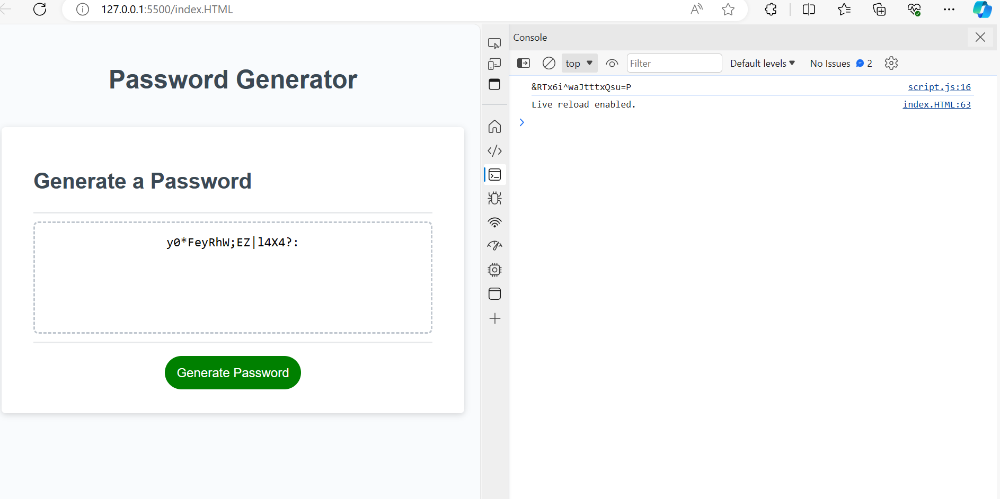

# Password-Generator-Challenge
The purpose is to create an application to generate random passwords using HTML, CSS and Javascript to select a password with criteria that include; lower case, upper case,numeric , special characters and a minimum length of eight(8) characters.

## Features

-HTML and CSS used to design the web application page.
-Javascript functions and methods used to generate random passwords.

## Screenshot of the results

## Link to page

https://aod4141.github.io/Passwords-Generator-Project/

## Link to repo

https://github.com/AOD4141/Passwords-Generator-Project

## Authors

- [GitHub - Adebayo Dada](https://github.com/AOD4141)

## License

- This application is covered under: [MIT License](https://choosealicense.com/licenses/mit)
